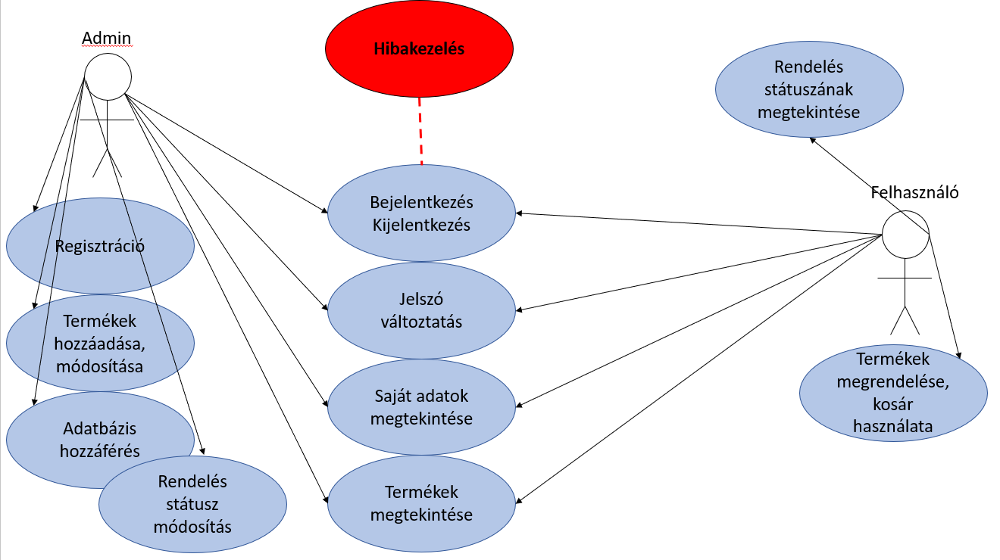
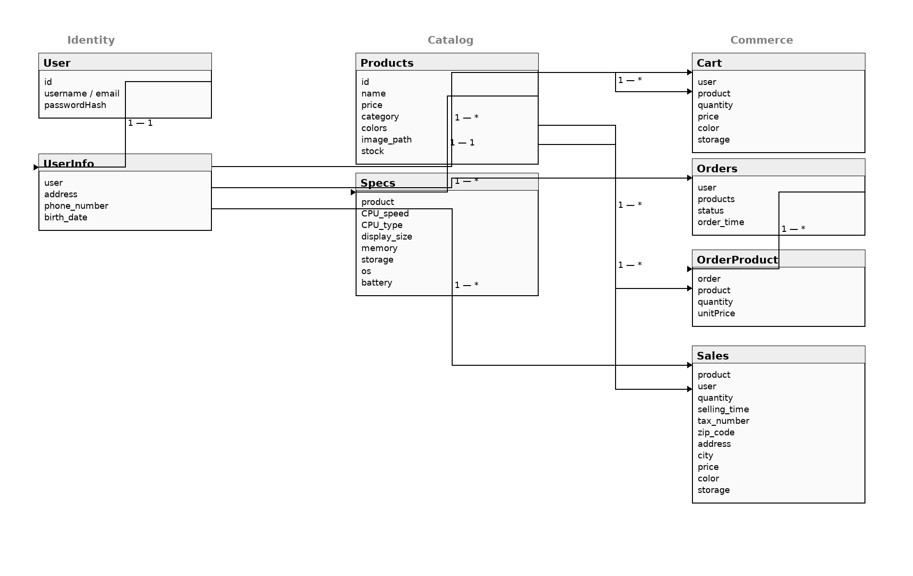
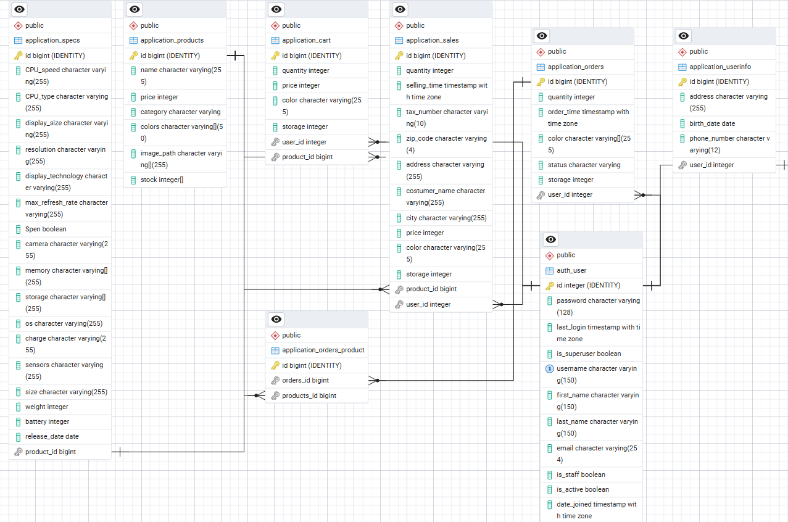

# AI-powered-Webshop Rendszerterv

### A rendszer célja

Az AI-powered Webshop célja, hogy modern,
könnyen kezelhető és megbízható online vásárlási felületet biztosítson a felhasználók számára.
A rendszer célja, hogy egyszerűvé tegye a termékek böngészését, összehasonlítását és megvásárlását,
miközben átlátható információkat nyújt a készletekről és az árakról.

A webshop központi eleme a felhasználóbarát felület,
amely lehetővé teszi, hogy a vásárlók gyorsan megtalálják a keresett termékeket,
szűrjenek kategória vagy ár alapján, és néhány kattintással rendelést adjanak le.
A kosárfunkció segítségével több termék is egyszerre kezelhető, így a vásárlási folyamat gyors és kényelmes.

A rendszer beépített AI-asszisztense segíti a felhasználókat a döntéshozatalban:
válaszol a kérdéseikre, ajánl releváns termékeket és támogatja a keresést természetes nyelvű kérdések alapján. 
z növeli a felhasználói élményt és csökkenti a keresési időt.

A cél egy stabil, biztonságos és rugalmas online platform megvalósítása,
amely hosszú távon is képes alkalmazkodni a változó igényekhez,
és hatékonyan támogatja a vásárlók mindennapi online vásárlási szokásait.

### Projektterv

A projektet négytagú fejlesztőcsapat valósítja meg, 
amelyben minden tag részt vesz a backend, frontend, tesztelési és dokumentációs feladatokban. 
A feladatmegosztás rugalmas, így a csapat gyorsan tud alkalmazkodni a fejlesztés során felmerülő igényekhez. 
A közös munka során kiemelt szerepet kap a tudásmegosztás, a folyamatos kommunikáció és az átlátható feladatkövetés.

**Fő feladatkörök:**
- **Backend fejlesztés:** Django alapú logika és adatbázis kapcsolat kialakítása.
- **Frontend fejlesztés:** Django Template használatával reszponzív webes felület megvalósítása.
- **Tesztelés:** egység- és funkcionális tesztek készítése, hibák javítása.
- **Dokumentáció:** követelmény-, rendszer- és teszttervek kidolgozása.

A fejlesztés iteratív megközelítéssel történik, 
kisebb modulokra bontva (pl. bejelentkezés, keresés, kosár, AI-asszisztens). 
Minden fejlesztési szakaszt rövid tesztelési és visszajelzési ciklus követ,
így a csapat gyorsan reagálhat az esetleges hibákra vagy változtatásokra.

| Modul / Funkció         | Feladat                              | Állapot        |
|-------------------------|--------------------------------------|----------------|
| Felhasználói azonosítás | Regisztráció, bejelentkezés          | Kész           |
| Termékkezelés           | Keresés, szűrés, megjelenítés        | Folyamatban    |
| Kosárkezelés            | Termékek hozzáadása, eltávolítása    | Folyamatban    |
| AI-asszisztens          | Termékajánlások, keresési javaslatok | Tervezés alatt |
| Tesztelés               | Egység- és integrációs tesztek       | Folyamatban    |

*Az eredeti becslések, aktuális értékek és eltelt idő órában értendők.*  

A táblázat a fejlesztés során folyamatosan frissül, 
így mindig naprakész képet ad a projekt állapotáról. 
Segíti a csapat kommunikációját és az időgazdálkodást, 
mivel egyértelműen látható, mely feladatok igényelnek azonnali figyelmet, 
és hol szükséges erőforrásokat átcsoportosítani.

### Üzleti folyamatok modellje

### Követelmények

**Funkcionális követelmények**

- Felhasználók regisztrációja és bejelentkezése email-cím és jelszó alapján.  
- Jogosultsági szintek kezelése (admin, vásárló).  
- Termékek listájának megjelenítése, keresése és szűrése név, ár vagy kategória alapján.  
- Termékadatok valós idejű frissítése a készlet változásai szerint.  
- Kosárfunkció: termékek hozzáadása, eltávolítása és mennyiség módosítása.  
- Vásárlási folyamat támogatása a rendelés leadásáig.  
- Rendelés állapotának megtekintése a felhasználói fiókban.  
- AI-asszisztens által biztosított termékajánlások és keresési javaslatok.  
- Admin felület a termékek, rendelések és felhasználók kezelésére.

**Nem funkcionális követelmények**

- A rendszer felülete legyen letisztult, gyors és reszponzív.  
- A keresési és szűrési műveletek legfeljebb 2 másodpercen belül válaszoljanak.  
- Az oldal hibamentesen működjön modern böngészőkben (Chrome, Firefox, Edge, Safari).  
- A jelszavak biztonságos, egyirányú hash-eléssel legyenek tárolva.  
- Az adatbázis kapcsolata titkosított legyen.  
- A rendszer kezelje a többfelhasználós működést egyidejű hozzáférés esetén.  
- Naplózás és alapvető hibadetektálás valós időben működjön.

**Törvényi előírások és szabványok**

- A rendszer megfelel az **EU GDPR** adatvédelmi előírásainak.  
- Követi az **ISO/IEC 27001** adatbiztonsági szabvány alapelveit.  
- A felhasználói adatokhoz kizárólag engedélyezett személyek férhetnek hozzá.  
- Minden művelet naplózásra kerül az átláthatóság és visszakövethetőség érdekében.
5. Geri
### Funkcionális terv

**Rendszerszereplők:**
- Adminisztrátor  
- Vásárló  

**Rendszerhasználati esetek és lefutásaik:**

**Adminisztrátor:**
- Teljes hozzáféréssel rendelkezik a rendszerhez.  
- Felhasználók és jogosultságok kezelése.  
- Termékek hozzáadása, módosítása és törlése.  
- Készletadatok frissítése és árak módosítása.  
- Rendelések megtekintése, státuszok módosítása.  
- Rendszernaplók és statisztikák ellenőrzése.  

**Vásárló:**
- Regisztráció és bejelentkezés email-címmel és jelszóval.  
- Termékek megtekintése, keresése és szűrése név, kategória vagy ár alapján.  
- Termékek kosárba helyezése, mennyiség módosítása, eltávolítása.  
- Rendelés leadása és visszaigazolás megtekintése.  
- AI-asszisztens használata termékajánlások és információk kérésére.  
- Saját fiókadatok és korábbi rendelések megtekintése.  

A rendszer célja, hogy mindkét szereplő számára átlátható,
logikus működést biztosítson: az admin könnyen kezelje a termékeket és a készletet,
míg a vásárlók egyszerűen böngészhessenek és rendeljenek.

### Fizikai környezet

Az alkalmazás webes platformra készül, reszponzív kialakítással, így asztali számítógépeken és laptopokon is használható.
A rendszer nem igényel telepítést a felhasználó eszközére, mivel modern böngészőből érhető el (Chrome, Firefox, Edge, Safari).

A szerveroldali környezet a tervek szerint helyi (lokális) szerveren kerül kialakításra,
mivel ennek üzemeltetése jelentősen alacsonyabb költséggel jár,
így partnereink számára gazdaságosabb megoldást biztosít a rendszer hosszú távú fenntartására.

Biztonsági lépéseket teszünk az adatok megfelelő kezelése érdekében is, azáltal, hogy az adatbázishoz való hozzáférést csak
a megfelelő jogosultsággal rendelkezők számára ösztjuk meg. Az adatbázis szerver állandó üzemeltetésével és karbantartásával
próbáljuk elérni, hogy a felhasználók számára gördülékeny adathozzáférés jöjjön létre.

A rendszer teljes mértékben open source komponensekre épül, nem használ megvásárolt, zárt forráskódú szoftvert.

**Fejlesztésre használt eszközök:**

- Pycharm Professional - backend fejlesztése (Python Django keretrendszere)
- Visual Studio Code - fronted fejlesztése (HTML/CSS)
- Figma - felhasználói felület tervezése, képernyő tervezés
- Git és Github - verziókezelés és csapatmunka támogatása

### Architekturális terv

Az AI-powered Webshop architektúrája három rétegből épül fel:  
1. **Prezentációs réteg (frontend)**  
2. **Alkalmazásréteg (backend)**  
3. **Adatkezelési réteg (adatbázis)**  

A cél egy biztonságos, stabil és jól karbantartható rendszer kialakítása,
amely támogatja a termékek megjelenítését, a kosárkezelést, a rendelésfeldolgozást és az AI-asszisztens működését.

A **frontend** a Django Template rendszerére épül, amely HTML,
CSS és minimális JavaScript segítségével biztosítja az oldal megjelenítését és az interaktív elemeket,
például a kosár dinamikus frissítését.  

A **backend** Django keretrendszert használ, amely az MVC mintára épül:  
- **Model:** az adatbázis szerkezetét és kapcsolatokat kezeli.  
- **View:** az üzleti logikát valósítja meg.  
- **Template:** a felhasználói felület megjelenítését biztosítja.  

Az **adatkezelési réteg** PostgreSQL adatbázison alapul, amelyet a Django ORM kezel. Az adatbázis tárolja a felhasználókat, termékeket, rendelések adatait és a kosár tartalmát.  

A rendszer fő moduljai: felhasználókezelés, termékkezelés, kosár, rendelésfeldolgozás és AI-asszisztens.  
A jogosultságkezelés Django beépített `auth` rendszerével történik, session alapú autentikációval.  
Az architektúra célja a hosszú távon fenntartható, bővíthető és biztonságos működés biztosítása.

### Adatbázis terv

### Implementációs terv

A webáruház fejlesztése során a cél egy biztonságos,
jól strukturált és könnyen bővíthető rendszer létrehozása,
amely hatékonyan szolgálja ki a vásárlók igényeit.
Az alkalmazás kizárólag Django alapokon készül,
ahol a frontend a Django Template rendszert használja HTML, CSS és minimális JavaScript segítségével.
A kódok logikusan elválasztott fájlokban helyezkednek el,
ezzel elősegítve az átláthatóságot és a jövőbeli bővíthetőséget.

A backend a Django keretrendszeren fut,
amely kezeli a felhasználói autentikációt, a termékkezelést, a kosár- és rendeléslogikát,
valamint az adminisztrációs feladatokat.
A Django ORM biztosítja az adatbázis-műveletek biztonságos kezelését,
és garantálja az adatintegritást. Az adatbázis PostgreSQL alapú,
amely lokális szerveren fut, megfelelő indexeléssel a gyors lekérdezések érdekében.

A rendszer fő funkciói közé tartozik a regisztráció, bejelentkezés, termékkeresés,
kosárkezelés, rendelésleadás, valamint az adminisztrátori oldalon a termék- és felhasználókezelés.
Az AI-asszisztens a vásárlókat segíti termékajánlásokkal és kérdések megválaszolásával.

A rendelési folyamat során a backend ellenőrzi a készletet,
és a sikeres tranzakció után automatikusan frissíti az adatbázist.
A hibás vagy visszavont rendelések sztornózhatók,
a készlet pedig helyreállítható.
Az adatok titkosított formában tárolódnak,
a jelszavak hash-elve kerülnek mentésre.  

A rendszer teljesen reszponzív, és minden modern böngészőben fut.
A fejlesztés során egység- és integrációs tesztek biztosítják a stabil működést.
A verziókezelés Git alapon történik, a fejlesztők közösen dolgoznak egy helyi szerveren futó példányon.  

A cél egy megbízható, felhasználóbarát és karbantartható webshop megvalósítása,
amely hosszú távon is könnyen továbbfejleszthető.

### Tesztterv

A tesztelés célja annak biztosítása, hogy a rendszer minden komponense hibamentesen, a követelményeknek megfelelően működjön. A folyamat során ellenőrzésre kerül a funkcionalitás, a teljesítmény, a biztonság és a böngésző-kompatibilitás. Cél, hogy a rendszer stabil és megbízható legyen az éles használat során.

**1. Egységtesztelés (Unit Test)**
A fejlesztés során minden fontos funkcióhoz egységteszteket készítünk.  
Célja, hogy a backend logika, az adatbázis-kezelés és az űrlapfeldolgozás hibamentesen működjön.  
A kódlefedettség elvárt aránya 80% körüli.  
Tesztelendő fő modulok:
- Felhasználói autentikáció és jogosultságkezelés
- Termékek CRUD műveletei
- Kosár funkció (hozzáadás, törlés, árkalkuláció)
- Rendelés leadása és érvényesítése

**2. Alfa tesztelés**
A fejlesztői környezetben zajlik, a teljes rendszer működésének belső ellenőrzése.  
Fő cél: a hibák feltárása még az élesítés előtt.  
Tesztelt szempontok:
- Böngészők közötti kompatibilitás  
- Alapfunkciók (regisztráció, rendelés, kosár) helyes működése  
- Adatkezelés és hibaüzenetek megjelenítése  

**3. Béta tesztelés**
A rendszer valós felhasználói környezetben, tesztfelhasználók által kerül kipróbálásra.  
Célja az esetleges rejtett hibák feltárása és a felhasználói élmény vizsgálata.  
A visszajelzéseket a fejlesztői csapat kiértékeli, és szükség esetén módosításokat hajt végre.

### Tesztelendő funkciók

**Backend funkciók**
- **Adatbázis-kezelés:**  
  Az adatok rögzítése, módosítása és törlése hibamentesen működjön.  
- **Készletkezelés:**  
  A készletváltozások pontosan jelenjenek meg a vásárlások és visszavonások után.  
- **Felhasználókezelés:**  
  A regisztráció, bejelentkezés és jogosultságkezelés biztonságosan működjön.  
- **Rendeléskezelés:**  
  A rendelések helyesen rögzüljenek, a státuszok megfelelően frissüljenek.  

**Frontend funkciók**
- **Bejelentkezés:**  
  - Helyes adatok esetén a felhasználó sikeresen belép.  
  - Hibás adatoknál megfelelő hibaüzenet jelenik meg.  
- **Keresés és szűrés:**  
  - Termékek keresése név vagy kategória alapján.  
  - Szűrés ár, elérhetőség és márka szerint.  
- **Kosárkezelés:**  
  - Termékek hozzáadása és eltávolítása működjön hibamentesen.  
  - Kosárérték automatikusan frissüljön.  
  - Kosár tartalma maradjon meg kijelentkezés után is.  
- **Reszponzivitás:**  
  A weboldal helyesen jelenjen meg minden modern böngészőben és kijelzőméreten.  
- **AI-asszisztens:**  
  A felhasználói kérdésekre pontos és releváns válaszokat adjon.

### Telepítési terv

Az alkalmazás használatához nincs szükség külön telepítésre, mivel a rendszer teljes egészében webes felületen működik.  
A felhasználók modern böngészőn (Google Chrome, Mozilla Firefox, Edge, Safari) keresztül érik el a webáruházat, telepítés vagy konfiguráció nélkül.  

A backend Django alapú alkalmazás, amely a saját, lokális szerveren kerül futtatásra.  
Az adatbázis PostgreSQL rendszeren működik, szintén helyi kiszolgálón, biztosítva a gyors adatkezelést és a biztonságos működést.  

A szerver beállítása magában foglalja a szükséges Python-csomagok és Django környezet telepítését, az adatbázis inicializálását, valamint az adminisztrátori hozzáférések beállítását.  

A rendszer frissítése és karbantartása manuálisan történik, a fejlesztőcsapat által, közvetlenül a szerveren keresztül.  
A cél egy stabil, megbízható környezet biztosítása, amely minimális konfigurációs igényt támaszt a felhasználók felé.

### Karbantartási terv

A webáruház karbantartása rendszeres és tervezett feladatokat igényel annak érdekében, hogy a rendszer hosszú távon is biztonságosan, gyorsan és megbízhatóan működjön.

- **Technikai karbantartás:**  
  A szerver operációs rendszerének, a Django környezetnek és a PostgreSQL adatbázisnak rendszeres frissítése.  
  Az adatbázis optimalizálása, biztonsági mentések és helyreállítási tesztek végrehajtása.

- **Biztonsági karbantartás:**  
  Az SSL tanúsítvány érvényességének ellenőrzése, jelszóvédelmi szabályok és hozzáférési jogosultságok időszakos felülvizsgálata.  
  A sérülékenységek vizsgálata és javítása szükség esetén.

- **Tartalomkarbantartás:**  
  Termékadatok, árak, készletinformációk és leírások frissítése.  
  Elavult vagy kifutott termékek törlése, kategóriák újrastrukturálása igény szerint.

- **Teljesítményfigyelés:**  
  A rendszer sebességének és válaszidejének rendszeres mérése.  
  Hibanaplók elemzése, 404 és 500-as hibák javítása.

- **Tesztelés és ellenőrzés:**  
  A fő funkciók (regisztráció, bejelentkezés, kosár, vásárlás) rendszeres működésellenőrzése.  
  A frissítések után rövid funkcionális tesztek futtatása.

- **Dokumentáció:**  
  Minden változtatás és javítás naplózása, verziókövetése.  
  A karbantartási tevékenységek nyilvántartása belső dokumentációban.
